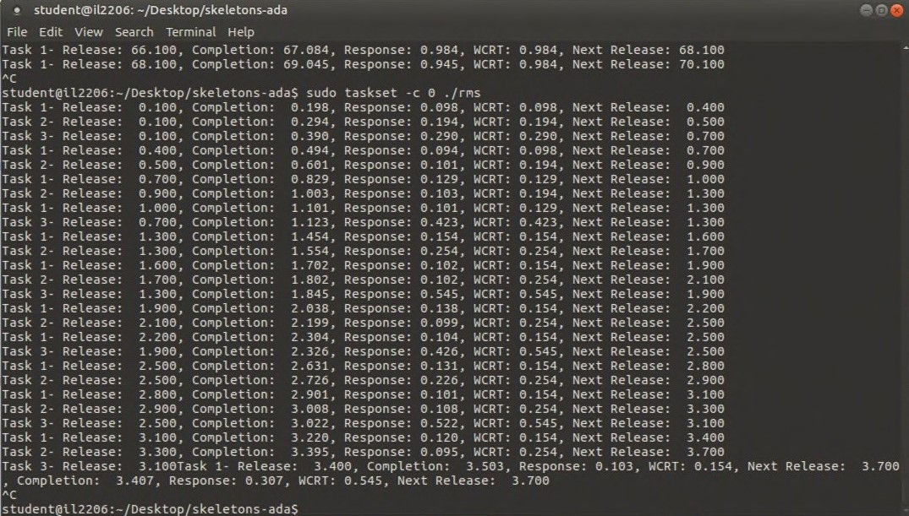
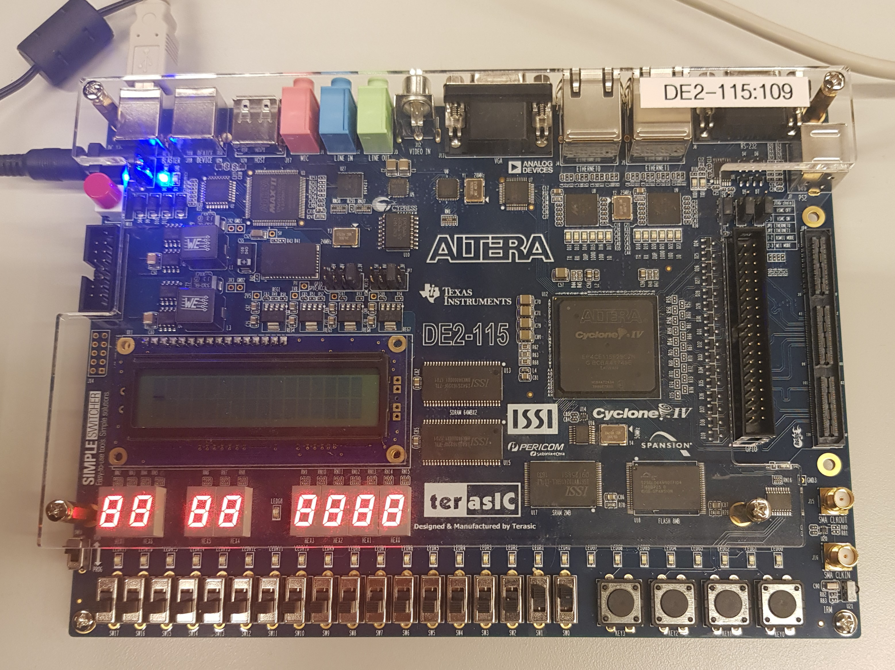

# IL2206 Embedded Systems
Repository for laboratories of the course [IL2206 Embedded Systems](https://www.kth.se/student/kurser/kurs/IL2206?l=en) in the winter semester 2022/2023 at KTH Stockholm.
The course covers both the hardware and software of embedded computer systems, with a focus on embedded realtime systems.

## Laboratory 1 : Concurrent and Real-Time Software Development in Ada
In Lab 1 synchronization & communication mechanisms (like semaphores and rendezvous) and concurrency and real-time features of Ada are applied. For instance, multiple tasks are implemented and scheduled with the rate-monotonic algorithm:

## Laboratory 2: Introduction to Real-Time Operating Systems (RTOS)
Lab 2 covers similar topics as Lab 1 but for this lab instead of Ada the RTOS MicroC/OS-II is used. Furthermore, a toy cruise control application for the Altera DE2-115 FPGA board is designed and implemented using MicroC/OS-II.
